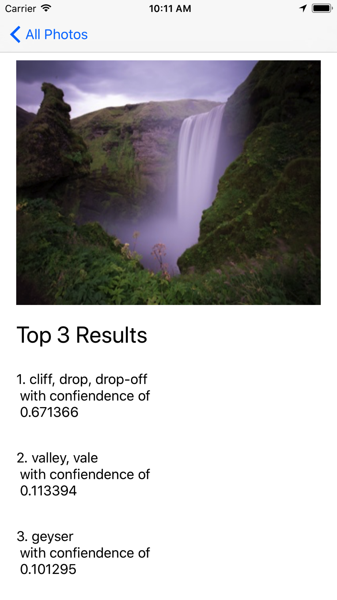

# PhotoOrganizer
Just an example app that I'm tinkering with to learn the Vision and CoreML concepts

## Sample Output
This is just the first step in implementing a smart photo organizer app. This screenshot illustrates what's possible using Vision machine learning APIs and the ResNet50 ML model.

